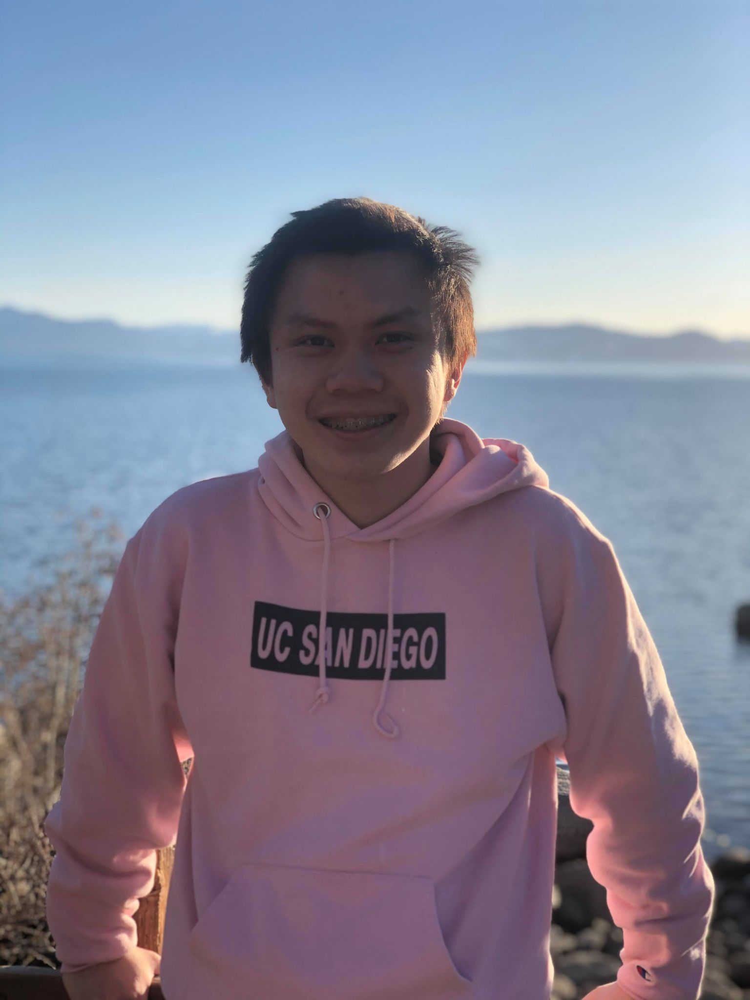

## Table of Contents
[About Me](#about-me)

[My Goals](#my-goals)

[Future of my User Page](#future-of-my-user-page)

## About Me
Hello! My name's Dennis and I'm a second-year undergraduate student at **UC San Diego** majoring in **Computer Science** and minoring in **Mathematics**. Through CSE 110, I'm working towards becoming a better software engineer. 

I think that this quote from W. Edwards Deming is something that every software engineer should live by:
> It is not enough to do your best: you must KNOW what to do, and THEN do your best.

Here's [a really cool picture](images/rick-roll.jpeg) I found randomly!

This quarter, I'm taking five classes. Here's a ranking of how excited I am for each of them, from most to least:
1. CSE 110
2. CSE 151A
3. CSE 101
4. CSE 199
5. MMW 15

## My Goals
I hope to go from only knowing how to `print("Hello World!")` to being able to create complex software projects that can be used and enjoyed by other people!

Be sure to check out [my GitHub](https://github.com/denniskluc) to see all the projects that I've worked on in the past!

Here's a list of things that I want to do in order to become a better software engineer:
- Try my best in CSE 110 and learn as much as I can.
- Do a great job during my internship this upcoming summer.
- Work on more personal projects.
- Learn more languages and technologies.
- Have fun!

## Future of my User Page
I still want to add a couple thing to my user page. Here's my current task list:
- [x] Add an introduction.
- [x] Add my course schedule.
- [ ] Add my resume.
- [x] Add my goals to become a better software engineer.
- [ ] Create a personal website and link it here. 
- [ ] Add my socials. 
- [x] Include my favorite quote. 
- [x] Add a picture of myself. 